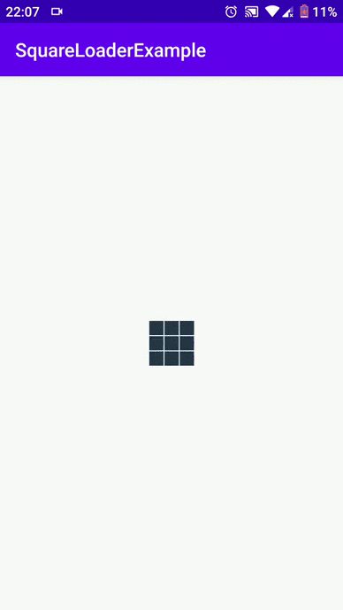

# SquareLoader [](https://jitpack.io/#r-yevchuk/squareloader)


Usage
-----

Add to your layout XML:
```xml
<com.squareloader.SquareLoader
       android:layout_width="wrap_content"
       android:layout_height="wrap_content"
       android:id="@+id/squareLoader"/>
```
Code:
```java
SquareLoader squareLoader = findViewById(R.id.squareLoader);
squareLoader.start();
```
Change size:
```java
squareLoader.setLoaderSize(Size.NORMAL); // SMALL, NORMAL, BIG
```
Change color:
```java
squareLoader.setPrimaryColor("#283747");
squareLoader.setSecondaryColor("#85929E");
```
Dependency
---
Add it in your root build.gradle at the end of repositories:
```java
allprojects {
    repositories {
	...
	maven { url 'https://jitpack.io' }
    }
}
```
add dependency：
```java
dependencies {
    implementation 'com.github.r-yevchuk:squareloader:0.9'
}
```
